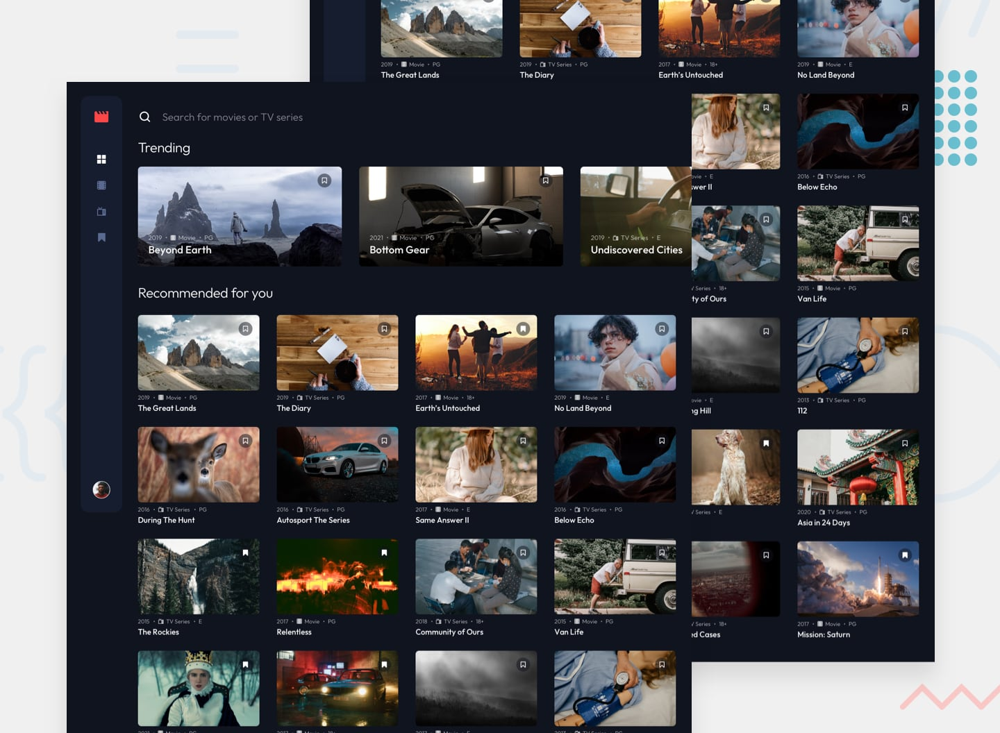

# Frontend Mentor - Entertainment web app

## The challenge

Build the entertainment web application and get it looking as close to the design as possible.

Your users should be able to- View the optimal layout for the atheir device's screen size

- Seeelements on the page
- Navigate between Home, Movies, TV Series, and Bookmarked Shows pages
- Add/Remove bookmarks from all movies and TV series
- Search for relevant shows on all pages

## Expected Behaviour

- General
  - The navigation menu should be fixed to the left for larger screens.
- Home
  - The trending section should scroll sideways to reveal other trending shows
  - Any search input should search through all shows (i.e. all movies and TV series)
- Movies
  - This page should only display shows with the "Movie" category
  - Any search input should search through all movies
- TV Series
  - This page should only display shows with the "TV Series" category
  - Any search input should search through all TV series
- Bookmarked Shows
  - This page should display all bookmarked shows from both categories
  - Any search input should search through all bookmarked shows

## Implementation

### Tech stack

- React
- Next.js
- Tailwind CSS

### API

- [TMDB](https://www.themoviedb.org/documentation/api)

### Routes

- `/`
- `/movies`
- `/tv`
- `/bookmarks`

Used server side rendering for the `/` (home) route, since the nature of data rendered (trending shows for example) is dynamic and changes frequently.

Used incremental static regeneration (1 day) for the `/movies` and `/tv` routes, because I thought not many new movies or TV shows are added frequently.

The `/bookmarks` route is rendered client side, as it reads from the local storage.

The searchbar is context based, meaning that it searches for shows based on the current route.

### TODO

- Implement auth and connect to the TMDB API so that actions in this app reflect in users' TMDB accounts.
- Add details page for each show.
